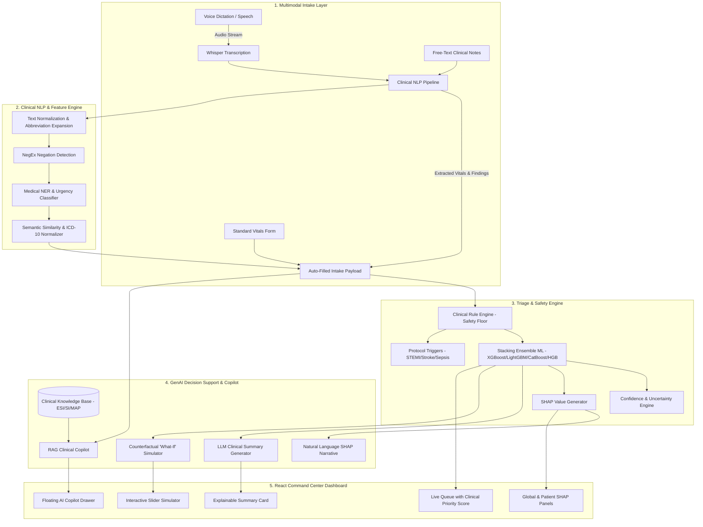
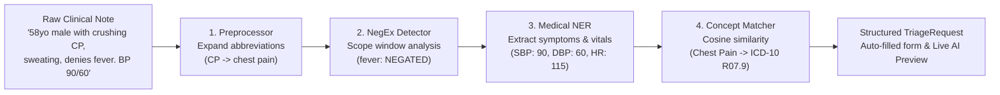
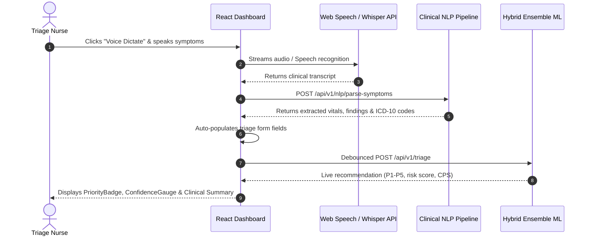
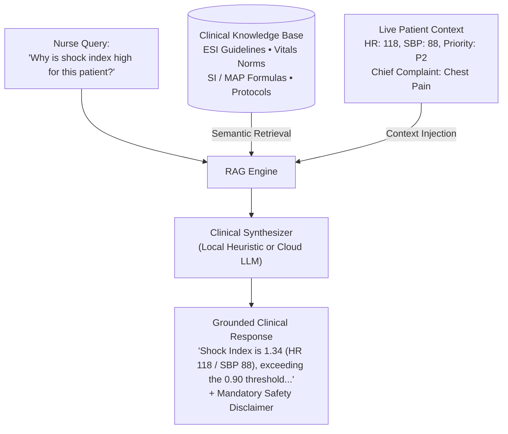

# JeevLok AI: Intelligent Emergency Clinical Decision Support System

### Next-Generation Multimodal AI Platform featuring Clinical NLP, Speech-to-Triage, Explainable Stacking Ensembles, and RAG Clinical Copilot

> **"The AI recommends. The clinician decides."**

JeevLok AI is an advanced, production-grade Clinical Decision Support System (CDSS) engineered for emergency department (ED) triage. Rooted in the Sanskrit concepts of **Jeev** (Life) and **Lok** (Realm/Dimension)—safeguarding and prioritizing human life through clinical technology—JeevLok AI augments clinical nursing judgment with natural language processing, speech recognition, calibrated machine learning ensembles, and conversational retrieval-augmented generation (RAG). Every recommendation is explainable, reviewable, overridable, and permanently audit-logged.

[](https://github.com/aanshiomar31-oss/JeevLok/actions/workflows/ci.yml)
[](https://fastapi.tiangolo.com)
[](https://react.dev)
[](https://vitejs.dev)
[](https://www.python.org)
[](https://www.docker.com)
[](https://physionet.org/content/mimic-iv-ed-demo/0.1.0/)
[](https://shap.readthedocs.io/)
[](LICENSE)

---

## Live Localhost Endpoints

When running locally, access the services via these endpoints:

| Service | Localhost URL | Description |
| :--- | :--- | :--- |
| **Frontend Web Application** | **[http://localhost:5173](http://localhost:5173)** | Interactive Command Center, Clinical NLP & Voice Intake, Live Queue, Explainability, and Copilot |
| **Interactive OpenAPI (Swagger)** | **[http://localhost:8000/docs](http://localhost:8000/docs)** | Live Swagger UI for testing all clinical NLP, GenAI, and triage endpoints |
| **ReDoc API Documentation** | **[http://localhost:8000/redoc](http://localhost:8000/redoc)** | Clean, publication-grade API documentation |
| **Backend Health Check** | **[http://localhost:8000/api/v1/health](http://localhost:8000/api/v1/health)** | Verifies database connectivity, ML artifact readiness, and service status |

---

## Executive Overview

Emergency Departments operate under severe cognitive load, time pressure, and unpredictable patient surges. Traditional triage relies heavily on subjective assessment, leading to variability in priority assignment during peak hours.

JeevLok AI addresses this through a **multimodal, human-in-the-loop clinical intelligence platform**:
- **Multimodal Intake**: Dictate symptoms via microphone, paste raw physician notes, or use structured inputs.
- **Clinical NLP Engine**: Parses free text, expands 30+ medical abbreviations, handles NegEx clinical negations (*"denies fever"*, *"no chest pain"*), extracts vital signs, and normalizes concepts to ICD-10-CM codes.
- **Hybrid Intelligence Layer**: Combines a deterministic Clinical Rule Engine (establishing safety floors) with a 4-model Stacking Ensemble (XGBoost, LightGBM, CatBoost, HistGradientBoosting) trained on MIMIC-IV-ED data.
- **Explainable GenAI Summaries**: Synthesizes high-signal clinical briefings with calculated physiological markers (Shock Index, MAP) and immediate protocol triggers.
- **RAG Clinical Copilot**: An interactive conversational assistant answering complex clinical queries with multi-turn memory and live patient context injection.
- **Counterfactual "What-If" Simulator**: Dynamic slider simulator allowing clinicians to observe how vital sign changes alter patient risk and priority in real time.
- **Professional Clinical UI**: Designed with clean SVG iconography, accessible high-contrast typography, and a healthcare-grade design system.

---

## Key Architectural Capabilities

### 1. Clinical NLP & Medical Entity Recognition
- **Abbreviation Expansion**: Expands 30+ emergency medical acronyms (`SOB` → shortness of breath, `CP` → chest pain, `LOC` → loss of consciousness, `HTN` → hypertension).
- **NegEx Negation Detection**: Utilizes directional scope windows to ensure negated symptoms do not falsely inflate triage urgency.
- **Regex Vitals Parser**: Extracts Blood Pressure (`120/80`), Heart Rate (`HR 115`), Respiratory Rate (`RR 24`), Temperature (`102.4 F`), SpO2 (`89%`), Pain (`9/10`), Age, and Gender from unstructured notes.
- **Concept Normalization & ICD-10 Mapping**: Normalizes colloquial phrasing (*"heart attack feeling"*, *"crushing chest pain"*) to formal concepts (`Chest Pain`, ICD-10 `R07.9`).
- **One-Click Form Auto-Fill**: Automatically populates all triage form fields from parsed notes.

### 2. Voice-to-Triage Dictation
- Integrated browser-side Web Speech API dictation and backend Whisper-compatible audio transcription endpoint (`POST /api/v1/voice/transcribe`).
- Audio stream $\rightarrow$ Speech-to-Text $\rightarrow$ Clinical NLP Extraction $\rightarrow$ Auto-Filled Patient Form $\rightarrow$ Live Triage Recommendation.

### 3. GenAI LLM Clinical Summaries
- Translates model risk scores and vital sign patterns into concise clinical briefings.
- Highlights physiological markers:
  - **Shock Index ($SI = HR / SBP$)**: Identifies occult hypoperfusion ($\ge 0.90$ threshold).
  - **Mean Arterial Pressure ($MAP = \frac{2 \cdot DBP + SBP}{3}$)**: Identifies hypoperfusion risks ($< 65\text{ mmHg}$).
- Recommends actionable emergency protocols (STEMI 12-lead ECG, Stroke FAST alert, qSOFA Sepsis bundle).
- Enforces the safety principle: *"AI recommends. Clinician decides."*

### 4. RAG Clinical Copilot (Conversational Assistant)
- Retrieval-Augmented Generation backed by an emergency medicine knowledge base.
- Multi-turn conversation memory keyed by session ID.
- Ingests live patient context to answer questions like:
  - *"Why is shock index high for this patient?"*
  - *"What does MAP mean?"*
  - *"Explain this triage recommendation."*
  - *"Show STEMI protocol checklist."*

### 5. Interactive Counterfactual Simulator
- What-If slider simulator allowing clinicians to adjust vital signs (SBP, HR, SpO2, RR) on the fly.
- Displays real-time risk score deltas ($\Delta\text{Risk}$) and priority transitions ($P2 \rightarrow P3$).
- Generates natural-language impact narratives and directional feature importance cards (escalating vs. stabilizing).

---

## End-to-End System Architecture



---

## Clinical NLP Pipeline Workflow



---

## Voice-to-Triage Sequence



---

## RAG Clinical Copilot Architecture



---

## API Documentation

FastAPI provides interactive OpenAPI documentation at `/docs` and ReDoc at `/redoc`.

### Core Endpoints

| Method | Endpoint | Description |
| :--- | :--- | :--- |
| `POST` | `/api/v1/nlp/parse-symptoms` | Parse free-text clinical notes into structured vitals, findings, and form payload |
| `POST` | `/api/v1/nlp/normalize` | Normalize colloquial symptom terms to ICD-10-CM concepts |
| `POST` | `/api/v1/summary` | Generate explainable LLM clinical summary with physiological indices |
| `POST` | `/api/v1/chat` | Query the RAG Clinical Copilot assistant with live patient context |
| `POST` | `/api/v1/voice/transcribe` | Whisper-compatible audio transcription and integrated NLP parsing |
| `POST` | `/api/v1/explain/counterfactual` | Evaluate "What-If" physiological scenarios and calculate risk score deltas |
| `POST` | `/api/v1/explain/narrative` | Generate natural-language explanation of SHAP feature impacts |
| `POST` | `/api/v1/triage` | Score patient through Clinical Rule Engine + Stacking Ensemble |
| `GET` | `/api/v1/queue` | Retrieve live waiting room queue sorted by Clinical Priority Score (CPS) |
| `POST` | `/api/v1/override` | Log clinician override with permanent audit trail |
| `POST` | `/api/v1/vitals/update` | Update waiting patient vitals and trigger dynamic reassessment |
| `GET` | `/api/v1/health` | Health check endpoint verifying database and ML artifact status |

---

## Project Structure

```
JeevLok/
├── .github/
│   └── workflows/
│       └── ci.yml                     # Automated CI testing & building pipeline
├── backend/
│   ├── alembic/                       # Database migration versions
│   ├── app/
│   │   ├── api/
│   │   │   ├── router.py              # Central APIRouter mounting all endpoints
│   │   │   └── routes/
│   │   │       ├── nlp.py             # /nlp/parse-symptoms & /normalize
│   │   │       ├── chat.py            # /chat (RAG Clinical Copilot)
│   │   │       ├── summary.py         # /summary (LLM clinical synthesis)
│   │   │       ├── voice.py           # /voice/transcribe (Whisper endpoint)
│   │   │       ├── explain.py         # /explain/counterfactual & /narrative
│   │   │       ├── triage.py          # /triage (ML intake scoring)
│   │   │       ├── queue.py           # /queue (Live Queue with CPS)
│   │   │       └── override.py        # /override (Audit-logged overrides)
│   │   ├── core/
│   │   │   ├── config.py              # Application settings & environment vars
│   │   │   └── database.py            # SQLAlchemy database engine & sessions
│   │   ├── llm/
│   │   │   ├── clinical_summary.py    # LLM summary generator & safety disclaimer
│   │   │   ├── knowledge_base.py      # ESI, SI, MAP, and emergency protocols
│   │   │   └── rag_engine.py          # RAG retrieval & session memory
│   │   ├── nlp/
│   │   │   ├── preprocessor.py        # Text cleaning & abbreviation expansion
│   │   │   ├── negation.py            # NegEx clinical negation detector
│   │   │   ├── entity_extractor.py    # Medical NER & regex vitals parsing
│   │   │   ├── similarity.py          # Semantic matching & ICD-10 taxonomy
│   │   │   └── pipeline.py            # Master ClinicalNLPPipeline orchestrator
│   │   ├── schemas/                   # Pydantic v2 validation models
│   │   ├── services/                  # CPS scoring, monitor loop, patient registry
│   │   └── websocket/                 # Real-time WebSocket connection manager
│   ├── ml/                            # Machine learning models, SHAP, and rule engine
│   ├── tests/                         # Pytest test suite (22 test cases)
│   │   ├── test_nlp_pipeline.py       # Unit tests for NLP, negation, and NER
│   │   ├── test_clinical_summary.py   # Unit tests for summary generation
│   │   ├── test_chat_copilot.py       # Unit tests for RAG assistant
│   │   ├── test_triage.py             # Unit tests for triage scoring & uncertainty
│   │   └── test_workflow.py           # Unit tests for full intake/override workflow
│   ├── Dockerfile                     # Multi-stage production backend container
│   └── requirements.txt               # Pinned Python dependencies
├── frontend/
│   ├── src/
│   │   ├── components/
│   │   │   ├── common/                # Clean clinical SVG icon library (Icons.jsx)
│   │   │   ├── nlp/                   # SymptomNLPInput, EntityChips, VoiceDictationBtn
│   │   │   ├── chat/                  # ClinicalCopilot conversational drawer
│   │   │   ├── summary/               # ClinicalSummaryCard with physiological indices
│   │   │   ├── explain/               # CounterfactualSim slider simulator
│   │   │   └── Layout.jsx             # Shell with navigation and Copilot
│   │   ├── pages/
│   │   │   ├── PatientIntake.jsx      # NLP & Voice intake page
│   │   │   ├── Explainability.jsx     # SHAP & Counterfactual page
│   │   │   ├── CommandCenter.jsx      # Hospital overview & live stats
│   │   │   └── LiveQueue.jsx          # CPS-prioritized waiting room
│   │   └── services/api.js            # Axios client for all backend endpoints
│   ├── vercel.json                    # Vercel SPA rewrite routing configuration
│   ├── Dockerfile                     # Node production container
│   └── package.json                   # React, Vite, and Tailwind dependencies
├── render.yaml                        # 1-Click Render Blueprint configuration
├── docker-compose.yml                 # Multi-container orchestration
└── README.md                          # Project documentation
```

---

## Quickstart & Local Installation

### Option 1: Run with Docker Compose (Recommended)

```bash
# 1. Clone the repository
git clone https://github.com/aanshiomar31-oss/JeevLok.git
cd JeevLok

# 2. Build and launch all services
docker compose up --build
```

- **Frontend Application**: [http://localhost:5173](http://localhost:5173)
- **FastAPI Backend**: [http://localhost:8000](http://localhost:8000)
- **Interactive OpenAPI Docs**: [http://localhost:8000/docs](http://localhost:8000/docs)

---

### Option 2: Local Manual Setup

#### Backend Setup:
```bash
cd backend

# Create and activate virtual environment
python3 -m venv venv
source venv/bin/activate  # On Windows: venv\Scripts\activate

# Install dependencies
pip install -r requirements.txt

# Start FastAPI server
uvicorn app.main:app --host 0.0.0.0 --port 8000 --reload
```

#### Frontend Setup:
```bash
cd frontend

# Install Node dependencies
npm install

# Start Vite dev server
npm run dev
```

---

## Running Automated Tests

Run the full pytest suite (all 22 test cases passing):

```bash
cd backend
pytest tests/ -v
```

Test coverage includes:
- Clinical NLP preprocessor abbreviation expansion
- NegEx clinical negation scope detection
- Medical NER vital sign parsing
- Semantic concept matching and ICD-10 taxonomy
- GenAI clinical summary generation (Shock Index, MAP)
- RAG Clinical Copilot multi-turn conversation and context injection
- Triage scoring, missing vitals uncertainty degradation, and hypoxia escalation
- Live waiting queue persistence, nurse overrides, and WebSocket broadcasts

---

## Cloud Deployment Guide

### Option A: 1-Click Render Blueprint (Backend + Frontend)
1. In the **[Render Dashboard](https://dashboard.render.com/)**, select **New +** $\rightarrow$ **Blueprint**.
2. Connect `https://github.com/aanshiomar31-oss/JeevLok`.
3. Render reads `render.yaml` to spin up:
   - `jeevlok-backend`: Python web service running `uvicorn app.main:app --host 0.0.0.0 --port $PORT`.
   - `jeevlok-frontend`: Static site serving `dist/` with SPA routing and automatic `VITE_API_URL` linkage.

### Option B: Vercel (Frontend) + Render / Railway (Backend)
1. **Backend on Render**:
   - Web Service pointing to `backend/`.
   - Build Command: `pip install -r requirements.txt`
   - Start Command: `uvicorn app.main:app --host 0.0.0.0 --port $PORT`
   - Copy backend URL (e.g., `https://jeevlok-backend.onrender.com`).
2. **Frontend on Vercel**:
   - Import `aanshiomar31-oss/JeevLok` on **[Vercel](https://vercel.com/new)**.
   - Root Directory: `frontend`.
   - Environment Variable: `VITE_API_URL=https://jeevlok-backend.onrender.com`.
   - `vercel.json` automatically manages client-side SPA route rewrites.

---

## Clinical Safety Principles

1. **Under-triage is worse than over-triage**: The rule engine strictly enforces minimum priority floors for red-flag findings.
2. **Missing data increases uncertainty**: Missing vital signs penalize model confidence rather than defaulting to healthy baseline assumptions.
3. **Clinician Authority**: The system provides decision support only. Licensed nurses and physicians retain absolute override authority with permanent audit logging.
4. **Mandatory Safety Disclaimer**: Every algorithmic output explicitly displays:
   > *"AI recommends. Clinician decides."*

---

## Author & Acknowledgements

- **Lead Engineer & Architect**: **Aanshi Omar** ([@aanshiomar31-oss](https://github.com/aanshiomar31-oss))
- **Attribution**: Originally developed collaboratively during early conceptual ideation. This repository represents an independently enhanced, production-grade clinical AI platform featuring advanced NLP pipelines, GenAI clinical summarization, RAG copilot, and Explainable AI counterfactual simulation.
- **License**: MIT License.
